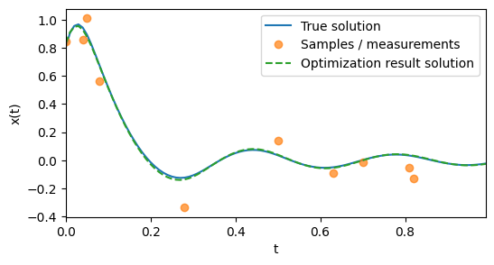

ODE Collapser
=============

_Warning: This repo is a work-in-progress. It is not currently in the most presentable state._

Given a 2nd-order ODE in the form
$$
\ddot{x} = f(\dot{x}, x, t)
$$
and a dataset of $(t, x)$ points (orange points), ODE Collapser finds the solution to the ODE minimizing the MSE of the dataset (green dashed curve).

It does this:
1. without being given any initial conditions,
2. without privileging any point of the dataset by using it as an initial or boundary condition
3. and without sweeping over any grid of initial condtions.

To experiment with the collapser, start with <./demo_notebooks/demo_use_of_libraries.ipynb>.

For detailed explanation of how this works, and current limitations, see <./writeup/ode_collapser.pdf>.

